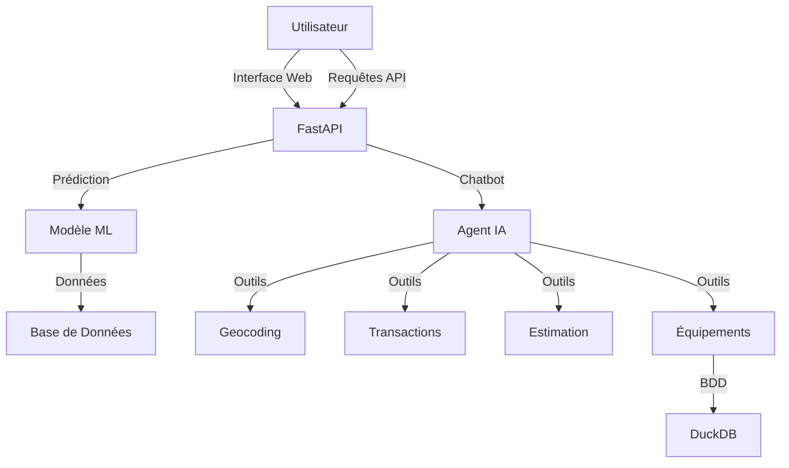
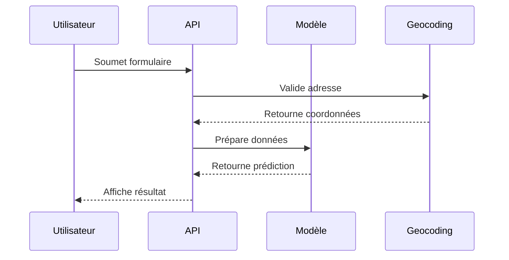
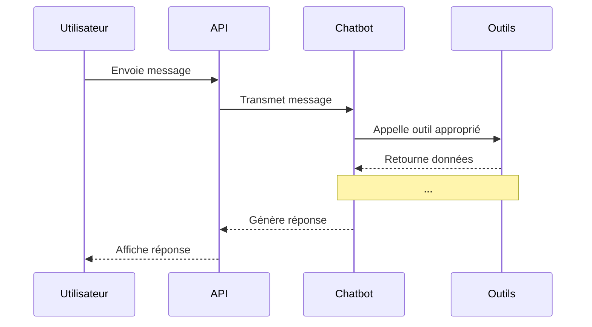

# Projet Immo - Prédiction de Prix Immobiliers

Application de prédiction du prix de biens immobiliers basée sur l'apprentissage automatique.

## Description

Ce projet vise à mettre à disposition une application permettant d'estimer le prix d'un bien immobilier en fonction de ses caractéristiques (localisation, surface, nombre de pièces, etc.).

## Fonctionnalités

- Prédiction du prix d'un bien immobilier
- Interface utilisateur pour saisir les caractéristiques du bien
- Modèle d'apprentissage automatique entraîné sur des données réelles
- API REST pour l'intégration dans d'autres applications
- Chatbot intelligent pour l'assistance utilisateur

## Architecture du Projet



## Technologies utilisées

- **Python** : Langage principal
- **Scikit-learn / XGBoost** : Modèles de machine learning
- **FastAPI** : Framework API REST
- **Pandas** : Manipulation des données
- **Docker** : Conteneurisation
- **MLflow** : Gestion du cycle de vie des modèles
- **LangChain** : Framework pour agents IA
- **LangSmith** : Monitoring d'agents IA
- **Mistral AI / Gemini** : Modèles de langage pour le chatbot

## Installation

### Prérequis

- Python 3.12+
- uv
- make

### Étapes

```bash
# Cloner le dépôt
git clone https://github.com/VestiC1/Projet-Agent-IA-Immo.git
cd Projet-Agent-IA-Immo

# Installer les dépendances
uv sync

# Activer un environnement virtuel
source .venv/bin/activate  # Sur Windows: .venv\Scripts\activate
```

## Utilisation

### Entraîner un modèle

```bash
python -m scripts.model_training_mlflow
```

### Lancer l'API

```bash
make fastapi
```

L'API sera accessible à l'adresse `http://localhost:8222`

### Documentation de l'API

La documentation interactive est disponible à `http://localhost:8222/docs`

## Déploiement avec Docker

### Construire l'image Docker

```bash
# Construire l'image
make build
```

### Exécuter le conteneur

```bash
# Lancer le conteneur
make run
```

### Arrêter le conteneur

```bash
# Arrêter le conteneur
make stop
```

## Structure du projet

```
Projet-immo/
├── data/               # Données brutes et traitées
├── docs/               # Documentation
├── model/             # Modèles entraînés
├── notebooks/          # Notebooks Jupyter d'exploration
├── src/
│   ├── app/            # Application FastAPI
│   │   ├── main.py      # Point d'entrée de l'API
│   │   ├── routes.py    # Routes de l'API
│   │   └── templates/  # Templates HTML
│   ├── agents/         # Agent IA et outils
│   │   ├── agent.py     # Définition de l'agent
│   │   └── tools/       # Outils de l'agent
│   └── inference/      # Logique de prédiction
│       └── model.py    # Modèle d'inférence
├── scripts/           # Scripts utilitaires
│   ├── model_training_mlflow.py  # Entraînement du modèle
│   └── run_api.py      # Lancement de l'API
├── tests/              # Tests unitaires
├── pyproject.toml     # Dépendances Python
└── README.md          # Ce fichier
```

## Flux de Prédiction



## Flux du Chatbot



## Données

Le projet utilise deux sources de données principales :

1. **Données DVF** : Les Demandes de Valeurs Foncières fournies par le gouvernement français via l'API Cerema, qui recensent l'ensemble des ventes immobilières des 5 dernières années. Ces données sont utilisées par les outils de transactions et d'estimation.

2. **Base Permanente des Équipements (BPE)** : Données INSEE sur le dénombrement des équipements par commune (écoles, commerces, infrastructures, etc.). Ces données sont stockées dans une base DuckDB et utilisées par l'outil d'équipements.

Sources :
- [API Cerema DVF](https://www.data.gouv.fr/fr/datasets/demandes-de-valeurs-foncieres/)
- [BPE INSEE](https://www.insee.fr/fr/metadonnees/source/operation/s2216/presentation)

## Modèle d'Agent IA

L'agent utilise plusieurs outils spécialisés :

1. **Geocoding** : Conversion d'adresse en coordonnées GPS
2. **Commune Info** : Récupération d'informations sur les équipements
3. **Transactions** : Liste des transactions récentes
4. **Estimation** : Prédiction de prix

Le monitoring se fait avec **LangSmith** via l'interface web suivante : https://eu.smith.langchain.com 
## Configuration

Le projet utilise plusieurs fichiers de configuration :

- `config.py` : Configuration principale
- `config_agent.py` : Clés API pour les modèles de langage
- `.env` : Variables d'environnement

## Tests

Pour exécuter les tests :

```bash
make test
```

## License

Ce projet est sous license MIT - voir le fichier [LICENSE](LICENSE) pour plus de détails.
