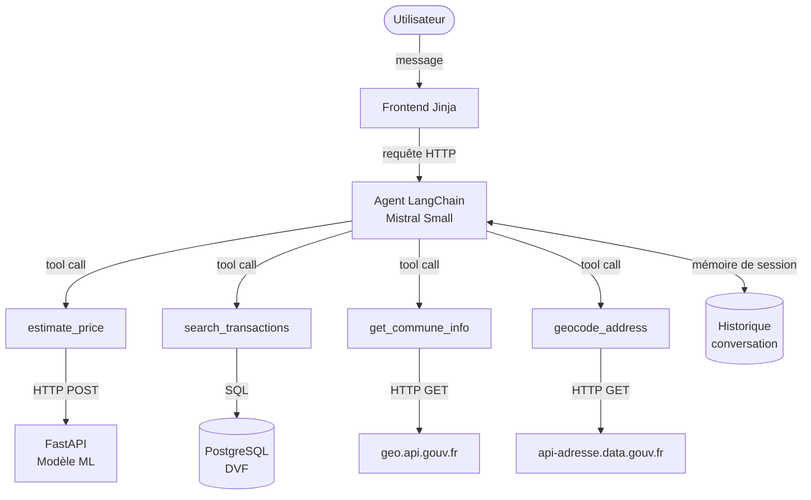

# NOTE DE CADRAGE — AGENT IA IMMOBILIER

## 1. Informations générales

| | |
|:---|:---|
| **Titre du projet** | Agent IA Immobilier |
| **Équipe** | Jonathan, Steve, Cyril |
| **Date de début** | 09/03/2026 |
| **Date de livraison** | 13/03/2026 |
| **Dépôt GitHub** | https://github.com/VestiC1/Projet-Agent-IA-Immo.git |

---

## 2. Contexte et objectif

Immo Solutions dispose d'un modèle de prédiction de prix immobilier entraîné sur les données DVF, actuellement exposé via une API FastAPI. Le frontend existant effectue un appel de géocodage puis transmet les coordonnées à l'API pour obtenir une estimation.

L'objectif de ce projet est d'encapsuler cette infrastructure dans un **agent conversationnel** capable de fournir aux agents immobiliers un accès unifié à plusieurs fonctionnalités via une interface de chat.

Le modèle de prédiction couvre les **maisons et les appartements** (type_local IN ('Maison', 'Appartement')).

---

## 3. Périmètre fonctionnel

### 3.1 Fonctionnalités retenues

| Fonction | Description | Source |
|:---|:---|:---|
| **Estimation de prix** | Estimation du prix d'une maison à partir de ses caractéristiques (surface, localisation) | Modèle ML existant via FastAPI |
| **Recherche de transactions DVF** | Recherche de ventes similaires filtrées par critères (commune, surface, fourchette de prix, périmètre géographique) | Base PostgreSQL alimentée par DVF |
| **Informations sur une commune** | Données administratives et géographiques sur une commune | API geo.api.gouv.fr + api-adresse.data.gouv.fr |
| **Interface de chat** | Conversation en langage naturel avec l'agent | LLM + framework d'orchestration |
| **Historique des conversations** | Conservation du contexte au fil de la session | Mémoire de l'agent |

### 3.2 Hors périmètre

- Recherche de biens à louer ou à vendre en temps réel (annonces)
- Estimation pour appartements, locaux commerciaux ou terrains
- Modification ou publication de données
- Authentification des utilisateurs
- Analyse concurrentielle (SeLoger, Meilleurs Agents, PAP, etc.) — reportée après le POC. Une comparaison pertinente suppose une baseline fonctionnelle établie ; la réaliser avant le POC reviendrait à comparer des intentions à des produits matures

---

## 4. Architecture technique

### 4.1 Stack technologique

| Composant | Technologie retenue | Justification |
|:---|:---|:---|
| Modèle de prédiction | Modèle ML maison (existant) | Déjà entraîné et validé sur DVF |
| Backend / API prédiction | FastAPI (existant) | Déjà en production |
| Orchestration agent | LangChain | Framework mature (2023+), mémoire de session native (`ChatMessageHistory`), large base d'exemples agents disponibles, adapté à un délai d'une semaine avec 4 tools. La validation des inputs est assurée par des schémas Pydantic définis manuellement sur chaque tool |
| LLM | Mistral Small (api.mistral.ai) | Free tier disponible, support du français natif, tool calling fiable, stack cohérente avec les APIs françaises utilisées |
| Base de données | PostgreSQL | Requêtes SQL structurées, ingestion DVF maîtrisée, prévisible |
| Frontend | Templates Jinja | Intégration native avec FastAPI existant, rendu côté serveur, pas de dépendance supplémentaire |
| Géocodage | api-adresse.data.gouv.fr | API officielle française, gratuite, sans authentification |
| Infos communes | geo.api.gouv.fr | API officielle, couvre communes / départements / régions |
| Versionnement | Git + GitHub | Standard du projet |

### 4.2 Schéma d'architecture

### 4.3 Sources de données externes

| Source | Données récupérées | Méthode d'accès |
|:---|:---|:---|
| DVF (data.gouv.fr) | Transactions immobilières maisons/appartements | DVF+ Cerema — fichiers SQL par département, 1 ligne par mutation, ingestion PostgreSQL directe |
| Communes France (data.gouv.fr) | Population, densité, superficie, statut urbain/rural par commune | Fichier CSV annuel, ingestion PostgreSQL, jointure code INSEE |
| BPE INSEE (data.gouv.fr) | Équipements et services par commune (écoles, commerces, santé, transports — 229 types) | Fichier CSV annuel, ingestion PostgreSQL, jointure code INSEE |
| api-adresse.data.gouv.fr | Géocodage adresse → coordonnées GPS | API REST |
| geo.api.gouv.fr | Métadonnées communes (nom, code INSEE, département) | API REST |

### 4.4 Outils de l'agent (tools)

| Nom de l'outil | Description | Source |
|:---|:---|:---|
| `estimate_price` | Appelle l'API FastAPI existante avec surface + coordonnées GPS | FastAPI interne |
| `search_transactions` | Recherche des ventes DVF filtrées (commune, surface ±20%, date, périmètre) | PostgreSQL |
| `get_commune_info` | Retourne les informations administratives d'une commune à partir d'un nom ou code INSEE | geo.api.gouv.fr |
| `geocode_address` | Convertit une adresse en coordonnées GPS | api-adresse.data.gouv.fr |

---

## 5. Modélisation des données

### Table `transactions_dvf`

| Colonne | Type | Description |
|:---|:---|:---|
| id | SERIAL PRIMARY KEY | Identifiant interne |
| date_mutation | DATE | Date de la transaction |
| commune | VARCHAR | Nom de la commune |
| code_insee | VARCHAR(5) | Code INSEE de la commune |
| surface_reelle_bati | FLOAT | Surface habitable en m² |
| valeur_fonciere | FLOAT | Prix de vente en euros |
| latitude | FLOAT | Latitude (géocodée) |
| longitude | FLOAT | Longitude (géocodée) |
| prix_m2 | FLOAT | Valeur calculée à l'ingestion |

Filtre appliqué à l'ingestion : `type_local IN ('Maison', 'Appartement')`

---

## 6. Organisation du travail

### 6.1 Planification

| Jour | Objectifs | Tâches |
|:---|:---|:---|
| Lundi | Initialisation | Note de cadrage, benchmark, setup repo, ingestion DVF |
| Mardi | Développement tools | Implémentation des 4 tools, tests unitaires |
| Mercredi | Jalon mi-parcours | Agent fonctionnel avec au moins 2 tools, démo interne |
| Jeudi | Intégration | Interface de chat Jinja, mémoire de session, tests end-to-end |
| Vendredi | Finalisation | Documentation, nettoyage code, préparation soutenance |

---

## 7. Contraintes et risques

| Risque | Probabilité | Impact | Plan B |
|:---|:---|:---|:---|
| Ingestion DVF trop longue | Moyenne | Élevé | Restreindre à 1-2 départements |
| API FastAPI indisponible | Faible | Élevé | Mock de l'estimation pour la démo |
| LLM génère des paramètres invalides pour les tools | Moyenne | Moyen | Validation Pydantic sur les inputs de chaque tool |
| Latence LLM trop élevée en démo | Faible | Moyen | Mistral Small est suffisamment rapide sur le free tier |
| Transactions non géolocalisées dans DVF+ | Faible | Faible | Ces transactions tombent hors scope du filtre rayon — comportement acceptable, à documenter |
| Projet ciblant Alsace-Moselle ou Mayotte | Nulle (hors périmètre) | Élevé | DVF non disponible pour ces territoires — hors périmètre du projet |

---

## 8. Critères de succès

### MVP (minimum acceptable vendredi)

- [ ] L'agent répond en français à une question d'estimation de prix
- [ ] L'agent retourne des transactions DVF filtrées par commune
- [ ] L'interface de chat fonctionne de bout en bout
- [ ] Le contexte de conversation est conservé sur la session

### Nice to have

- [ ] Filtrage par périmètre géographique (rayon en km)
- [ ] Affichage d'une carte des transactions retournées
- [ ] Reformulation automatique de la réponse en langage naturel structuré